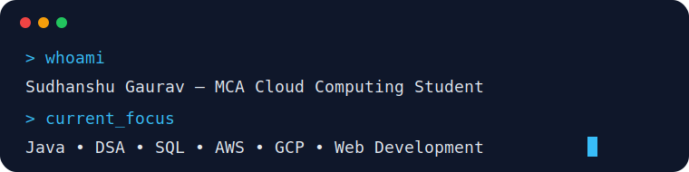

 

  

## 👨‍💻 About Me

- 🎓 Pursuing **MCA with specialization in Cloud Computing** at **Parul University**
- ☁️ Interested in **Cloud Computing, AWS and GCP**
- 💻 Skilled in **Java, DSA, SQL, HTML, CSS, JavaScript and PHP**
- ✨ Working with **GSAP** for web animations
- 🐍 Familiar with **basic Python**
- 🗄️ Working with **MySQL**
- 🚀 Focused on improving my development and problem-solving skills

  

## 🛠️ Technical Skills

### Programming

### Web Development

  

### Database and Cloud

### Tools

## 🎯 Currently Focused On

  

## 🔥 GitHub Activity

  

 

  

